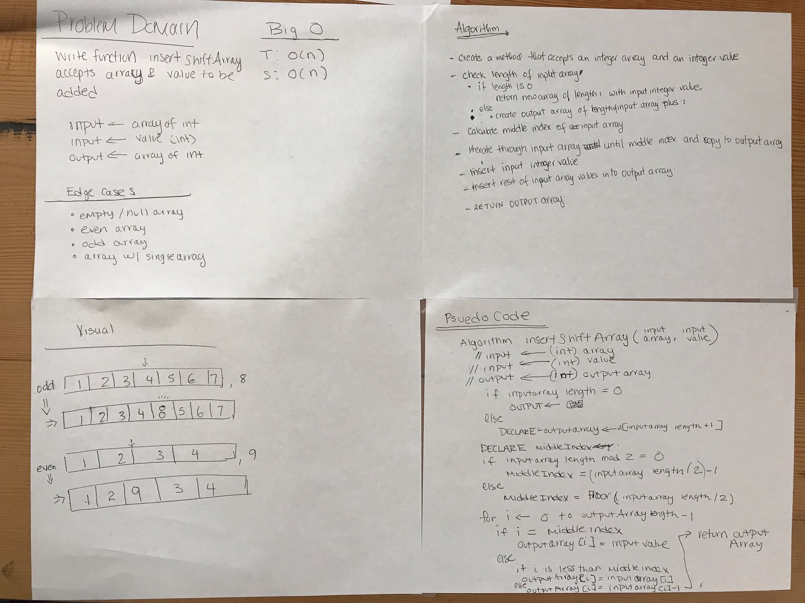

# Array Shift

## Challenge
Given an integer and an array, add the integer to the middle of the array. 

## Approach & Efficiency
Divide the length of the array by two and round up to the nearest whole number depended on the length of the input array. 
Then create an output array to add the input array items into the output, leaving space for the new integer to be 
inserted in the middle of it. 

This loops through the array one time. Time and space is O(n).

## Solution
[Code](../src/main/java/arrayShift/ArrayShift.java) | [Tests](../src/test/java/arrayShift/ArrayShiftTest.java)
