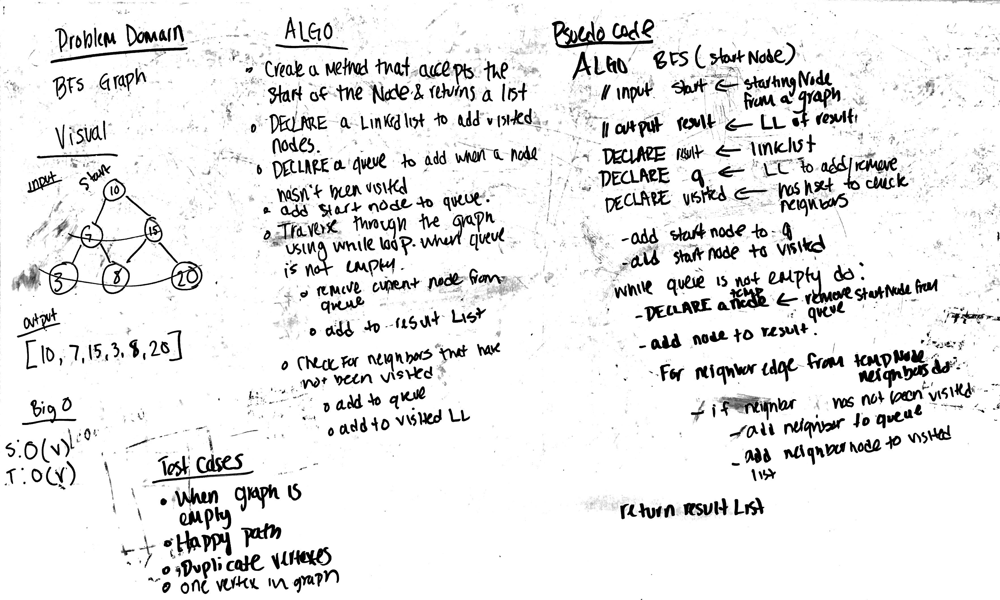

# Breadth First Search with Graph
Implement a breadth-first traversal on a graph.

## Challenge
Extend your graph object with a breadth-first traversal method that accepts a starting node. Without utilizing any of 
the built-in methods available to your language, return a collection of nodes in the order they were visited. 
Display the collection.

## Approach & Efficiency
Create a method that accepts a starting Node of a graph using a queue. The method returns a LinkedList of Nodes.
The queue will add the children of the current node while the queue is not empty. The queue will eventually remove 
the nodes and add to LinkedList. Also, Using the Edge class, we check if the neighbor of the current node has been 
visited. 

Time | Space
--- | ---
O(v) | O(v)

## Solution
[Code](../src/main/java/graph/Graph.java) | [Tests](../src/test/java/graph/GraphTest.java)

***Test***
 
Write tests to prove the following functionality:

- [x] Test if ALL keys match
- [x] Test if Some keys match
- [x] Test with second empty hashmap

## Checklist
- [x] Top-level README “Table of Contents” is updated
- [x] Feature tasks for this challenge are completed
- [x] Unit tests written and passing
    - [x] “Happy Path” - Expected outcome
    - [x] Expected failure
    - [x] Edge Case (if applicable/obvious)
- [x] README for this challenge is complete
    - [x] Summary, Description, Approach & Efficiency, Solution
    - [x] Link to code
    - [x] Picture of whiteboard