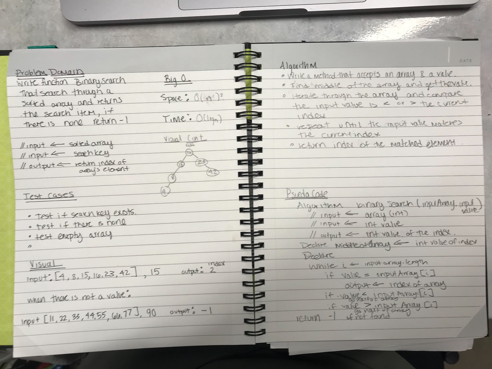

# Binary Search

## Challenge
Write a function called BinarySearch which takes in 2 parameters: a sorted array and the search key. Without utilizing
any of the built-in methods available to your language, return the index of the array’s element that is equal to the search key, or -1 if the element does not exist.

## Approach & Efficiency
Divide the length of the array by two and round up to the nearest whole number depended on the length of the input array. 
Then create an output array to add the input array items into the output, leaving space for the new integer to be 
inserted in the middle of it. 

This loops through the array one time. Time and space is ____.

## Solution
[Code](../src/main/java/binarySearch/BinarySearch.java) | [Tests](../src/test/java/binarySearch/BinarySearchTest.java)
