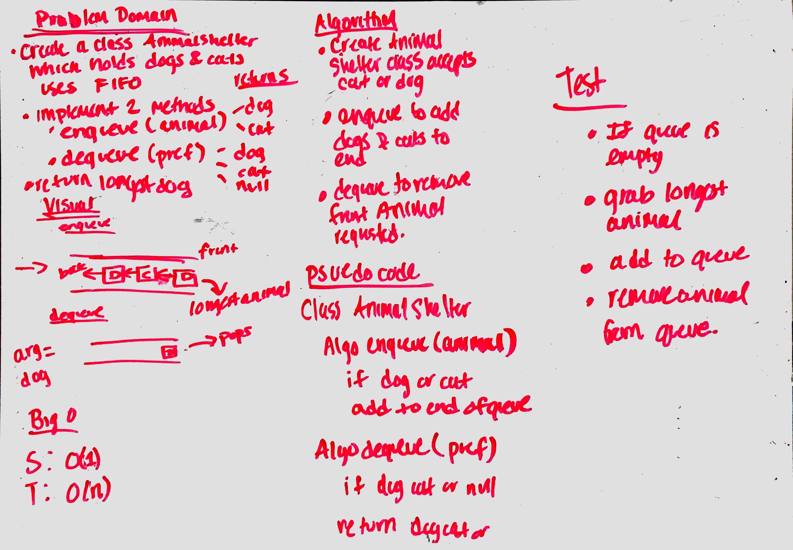

# Animal Shelter

First-in, First out Animal Shelter.

## Challenge

- Create a class called `AnimalShelter` which holds only dogs and cats. The shelter operates using a first-in, 
first-out approach.

Implement the following methods:
- `enqueue(animal)`: adds animal to the shelter. animal can be either a dog or a cat object.
- `dequeue(pref)`: returns either a dog or a cat. If pref is not "dog" or "cat" then return null.

## Approach & Efficiency

I created a class that holds two queues one for cat and one for dogs. When I wanted to add a cat, it goes into the 
queue and dog likewise. The front of the queue should contain the longest animal in the shelter.

Enqueue will have S: O(n) T:O(1)
Dequeue will have S: O(n) T: O(1)

## Solution

[Code](../src/main/java/fifoAnimalShelter/AnimalShelter.java) | [Tests](../src/test/java/fifoAnimalShelter/AnimalShelter.java)

## Checklist
- [x] Top-level README “Table of Contents” is updated
- [x] Feature tasks for this challenge are completed
- [x] Unit tests written and passing
    - [x] “Happy Path” - Expected outcome
    - [ ] Expected failure
    - [x] Edge Case (if applicable/obvious)
- [x] README for this challenge is complete
    - [x] Summary, Description, Approach & Efficiency, Solution
    - [x] Link to code
    - [x] Picture of whiteboard