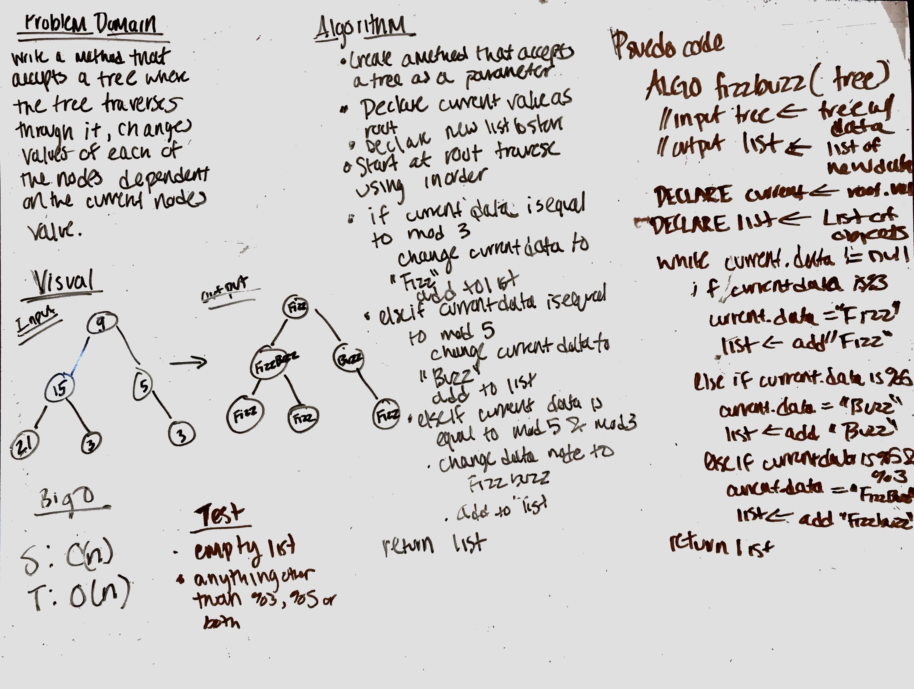

# Fizz Buzz Tree

## Challenge
Conduct “FizzBuzz” on a binaryTree while traversing through it. Change the values of each of the nodes dependent on the current node’s value

## Approach & Efficiency
- Write a function called FizzBuzzTree which takes a binaryTree as an argument.
- Without utilizing any of the built-in methods available to your language, determine weather or not the value of each
 node is divisible by 3, 5 or both, and change the value of each of the nodes:
    - If the value is divisible by 3, replace the value with “Fizz”
    - If the value is divisible by 5, replace the value with “Buzz”
    - If the value is divisible by 3 and 5, replace the value with “FizzBuzz”
     Return the binaryTree with its new values.

For explicitly-typed languages: Ensure your node values are of type Object, to hold either strings or integers.

## Solution
[Code](../src/main/java/fizzBuzzTree/FizzBuzzTree.java) | [Tests](../src/test/java/fizzBuzzTree/FizzBuzzTreeTest.java)

## Checklist
- [x] Top-level README “Table of Contents” is updated
- [x] Feature tasks for this challenge are completed
- [x] Unit tests written and passing
    - [x] “Happy Path” - Expected outcome
    - [x] Expected failure
    - [x] Edge Case (if applicable/obvious)
- [x] README for this challenge is complete
    - [x] Summary, Description, Approach & Efficiency, Solution
    - [x] Link to code
    - [x] Picture of whiteboard