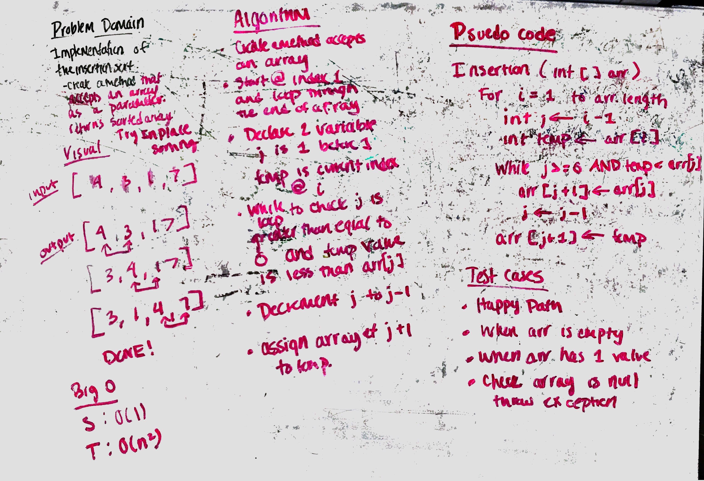

# Insertion Sort
## Learning Objectives
What is insertion sort?

## Lecture Flow

***Main Points***
- Insertion sort is a simple sorting algorithm that builds the final sorted array one item at a time. It is much less 
efficient on large lists than more advanced algorithms such as quicksort, heapsort, or merge sort.

- Insertion sort iterates, consuming one input element each repetition, and growing a sorted output list. At each 
iteration, insertion sort removes one element from the input data, finds the location it belongs within the sorted 
list, and inserts it there. It repeats until no input elements remain.
 
- Sorting is typically done in-place, by iterating up the array, growing the sorted list behind it. At each 
array-position, it checks the value there against the largest value in the sorted list (which happens to be next to it, in the previous 
array-position checked). If larger, it leaves the element in place and moves to the next. If smaller, it finds the correct
position within the sorted list, shifts all the larger values up to make a space, and inserts into that correct position.

# Challenge Summary
Insertion sort is a simple sorting algorithm that works the way we sort playing cards in our hands.

## Challenge Description
Create a method that accepts an array and performs insertion sort on the array. The goal is to sort in place rather 
than declaring another array to store and sort values.

## Approach & Efficiency
Using in place method starting at index 1 and loop through to compare each index and swap the adjacent value if it is
 smaller than the current value. 

Time | Space
--- | ---
O(n^2) | O(n)

## Solution
[Code](../src/main/java/insertionSort/InsertionSort.java) | [Tests](../src/test/java/insertionSort/InsertionSortTest.java)

## Resources

### Videos
https://www.youtube.com/watch?v=i-SKeOcBwko

### Reading
https://www.geeksforgeeks.org/insertion-sort/

## Checklist
- [x] Top-level README “Table of Contents” is updated
- [x] Feature tasks for this challenge are completed
- [x] Unit tests written and passing
    - [x] “Happy Path” - Expected outcome
    - [x] Expected failure
    - [x] Edge Case (if applicable/obvious)
- [x] README for this challenge is complete
    - [x] Summary, Description, Approach & Efficiency, Solution
    - [x] Link to code
    - [x] Picture of whiteboard
