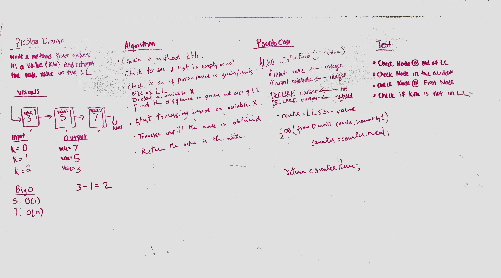

# kth from the End

## Challenge
k-th value from the end of a linked list.

## Approach & Efficiency
Write a method for the Linked List class which takes a number, k, as a parameter. Return the node’s value that is k from 
the end of the linked list. You have access to the Node class and all the properties on the Linked List class as well as 
the methods created in previous challenges. 

This loops through the array one time. Time and space is O(1) and O(n) respectively.

## Unit Tests
- [x] Where k is greater than the length of the linked list
- [x] Where k and the length of the list are the same
- [x] Where k is not a positive integer
- [x] Where the linked list is of a size 1
- [x] “Happy Path” where k is not at the end, but somewhere in the middle of the linked list

## Solution
[Code](../src/main/java/kthFromTheEnd/LinkedList.java) | [Tests](../src/test/java/kthFromTheEnd/LinkedList.java)
