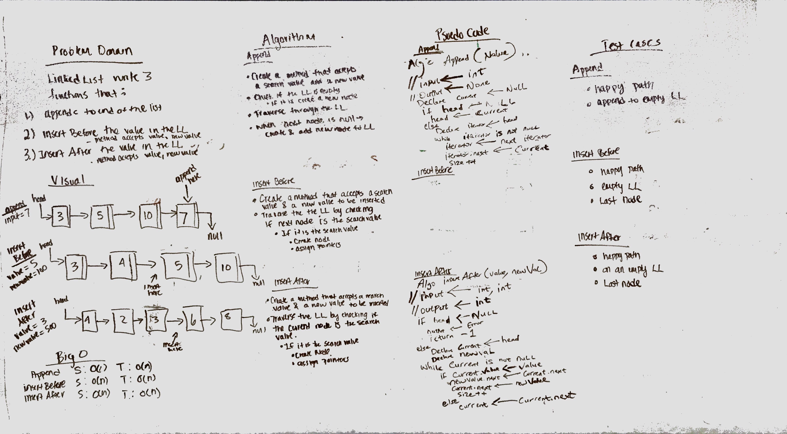

# Linked List Insertions

## Challenge

Linked list insertions by implementing the following:

- [x] .append(value) which adds a new node with the given value to the end of the list
- [x] .insertBefore(value, newVal) which add a new node with the given newValue immediately before the first value node
- [x] .insertAfter(value, newVal) which add a new node with the given newValue immediately after the first value node

## Approach & Efficiency
Writing each method inside the Linked List class.

## Features

Write tests to prove the following functionality:

- [x] Can successfully add a node to the end of the linked list
- [x] Can successfully add multiple nodes to the end of a linked list
- [x] Can successfully insert a node before a node located i the middle of a linked list
- [x] Can successfully insert a node before the first node of a linked list
- [x] Can successfully insert after a node in the middle of the linked list
- [x] Can successfully insert a node after the last node of the linked list

## Solution
[Code](../src/main/java/linkedListInsertion/LinkedList.java) | [Tests](../src/test/java/linkedListInsertion/LinkedListTest.java) 
