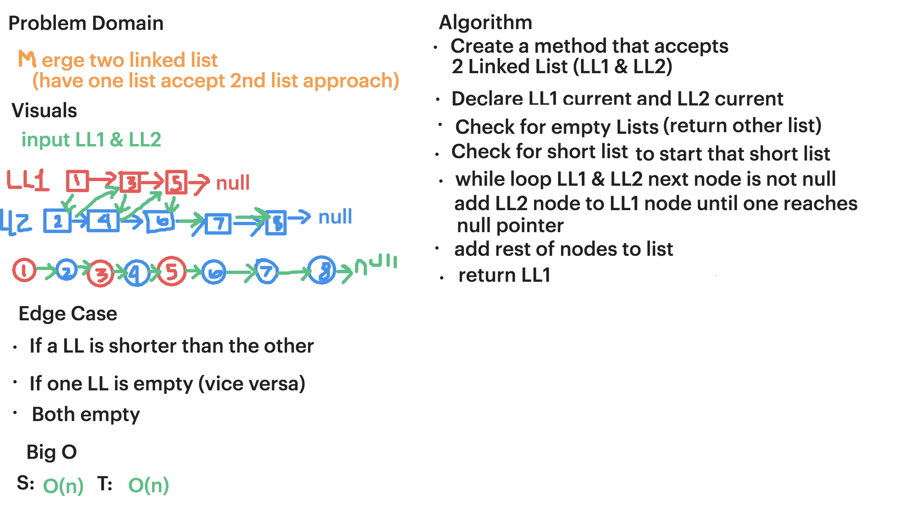

# Linked List Merge

## Challenge

Merge two linked lists.

Write a function called mergeLists which takes two linked lists as arguments. Zip the two linked lists together 
into one so that the nodes alternate between the two lists and return a reference to the head of the zipped list. 
Try and keep additional space down to O(1). You have access to the Node class and all the properties on the Linked
List class as well as the methods created in previous challenges.

## Approach & Efficiency
In order to achieve zip the two linked list, first check the length of each of the linked list, then change pointers and point the current node to the other LL 
node.

This loops through both linked list one time. Time and space is O(n) & O(1) respectively.

## Solution
[Code](../src/main/java/llMerge/LinkedList.java) | [Tests](../src/test/java/llMerge/LinkedListTest.java)

