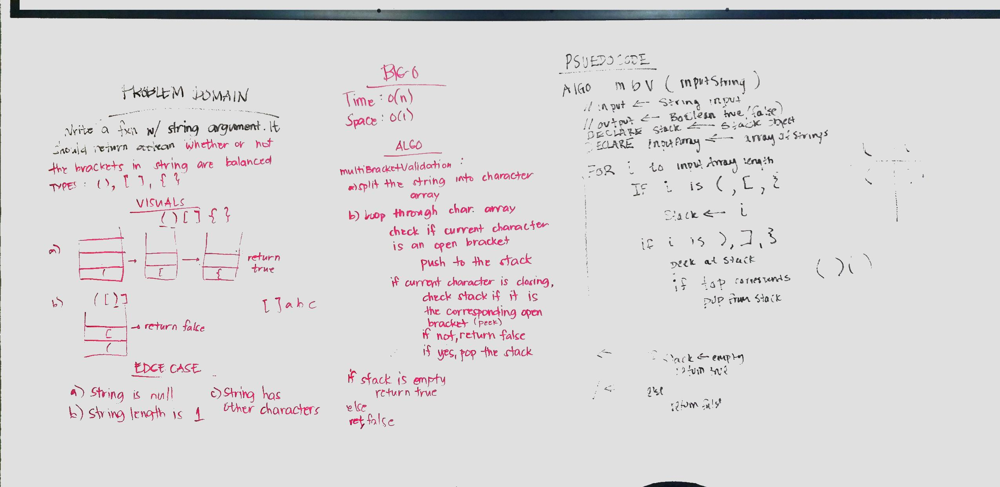

# Multi Bracket Validation

# Collaborators

Liz Mahoney and Jorie Fernandez

## Challenge
The function should take a string as its only argument, and should return a boolean representing whether or not the 
brackets in the string are balanced. There are 3 types of brackets:

```
Round Brackets : ()
Square Brackets : []
Curly Brackets : {}
```


## Approach & Efficiency
Created a method that accepts an string input, create a stack to push open brackets into the stack, then if the 
corresponding closing bracket matches pop the open bracket off the stack. Then check if stack is empty return true 
otherwise false for unbalanced bracket string.


This loops through the array one time. Time and space is O(n) and O(1) respectively.

## Solution
[Code](../src/main/java/multiBracketValidation/MultiBracketValidation.java) | [Tests](../src/test/java/multiBracketValidation/MultiBracketValidationTest.java)




## Checklist

 - [x] Top-level README “Table of Contents” is updated
 - [x] Feature tasks for this challenge are completed
 - [x] Unit tests written and passing
     - [x] “Happy Path” - Expected outcome
     - [x] Expected failure
     - [x] Edge Case (if applicable/obvious)
 - [x] README for this challenge is complete
     - [x] Summary, Description, Approach & Efficiency, Solution
     - [x] Link to code
     - [x] Picture of whiteboard