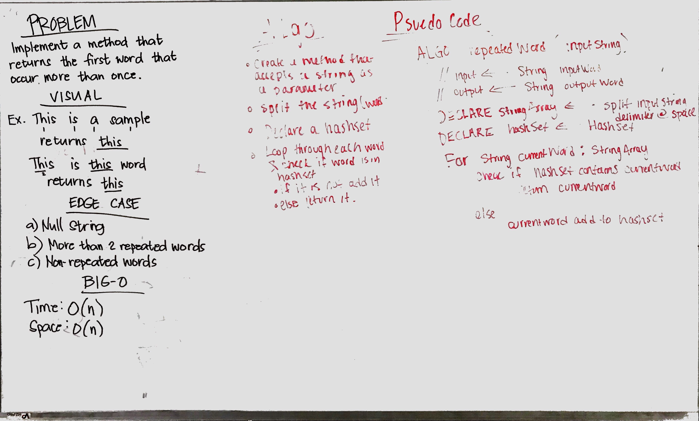

# Repeated Word with Hashtable

## Challenge
Write a function that accepts a lengthy string parameter.

## Approach & Efficiency

## Solution
[Code](../src/main/java/repeatedWord/RepeatedWord.java) | [Tests](../src/test/java/repeatedWord/repeatedWordTest.java)

## Features
 
 
***Test***
 
Write tests to prove the following functionality:
- [x]  Adding a key/value to your hashtable results in the value being in the data structure

## Checklist
- [x] Top-level README “Table of Contents” is updated
- [x] Feature tasks for this challenge are completed
- [x] Unit tests written and passing
    - [x] “Happy Path” - Expected outcome
    - [x] Expected failure
    - [x] Edge Case (if applicable/obvious)
- [x] README for this challenge is complete
    - [x] Summary, Description, Approach & Efficiency, Solution
    - [x] Link to code
    - [x] Picture of whiteboard